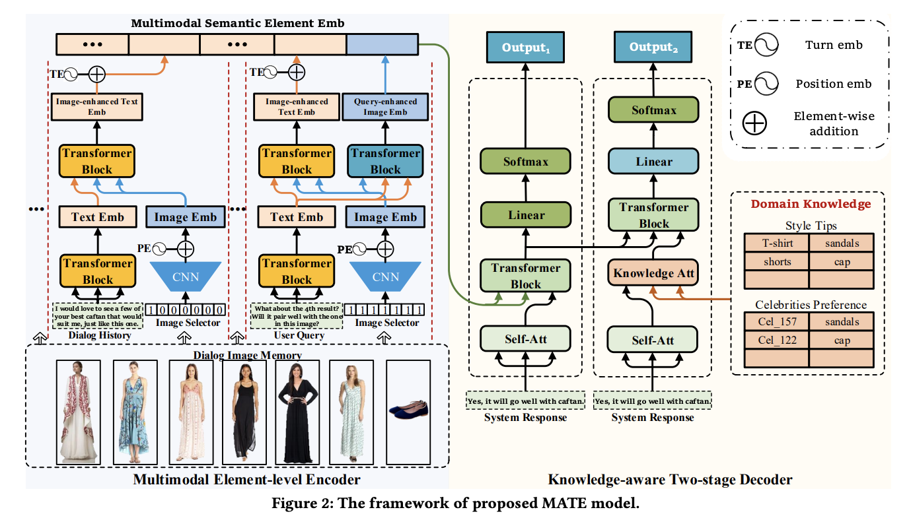
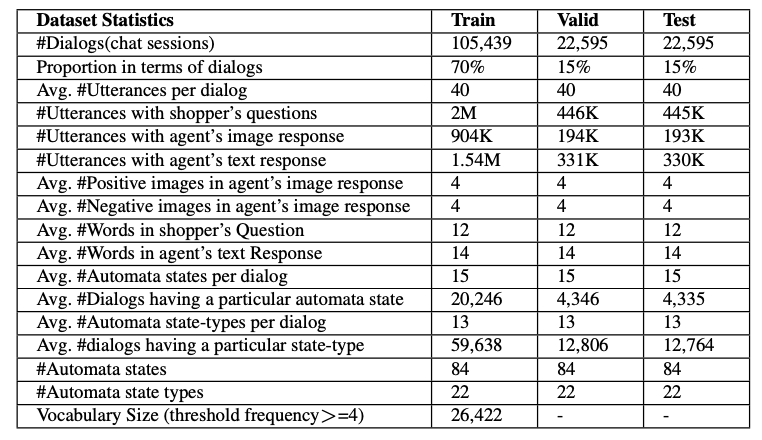

## MATE: Multimodal Dialogue Systems via Capturing Context-aware Dependencies of Semantic Elements


This is the PyTorch implementation of the paper:
**Multimodal Dialogue Systems via Capturing Context-aware Dependencies of Semantic Elements**. Weidong He, Zhi Li, Dongcai Lu, Enhong Chen, Tong Xu, Baoxing  Huai, Nicholas Jing Yuan. ***ACM MM 2020***. 
[[PDF]](https://dl.acm.org/doi/abs/10.1145/3394171.3413679?casa_token=NAfGkcF9aD4AAAAA:RycuI3YzktrxbcAiq10TPiJ3VseRsO_b7VhvTZM_5XZQX3k9Kqrqv8x1_BM3fKBJvC9XWK_tXvY)

If you use any source codes or datasets included in this toolkit in your work, please cite the following paper. The bibtex is listed below:
<pre>
@inproceedings{he2020multimodal,
  title={Multimodal Dialogue Systems via Capturing Context-aware Dependencies of Semantic Elements},
  author={He, Weidong and Li, Zhi and Lu, Dongcai and Chen, Enhong and Xu, Tong and Huai, Baoxing and Yuan, Jing},
  booktitle={Proceedings of the 28th ACM International Conference on Multimedia},
  pages={2755--2764},
  year={2020}
}
</pre>

## Abstract
Recently, multimodal dialogue systems have engaged increasing attention in several domains such as retail, travel, etc. In spite of the promising performance of pioneer works, existing studies usually focus on utterance-level semantic representations with hierarchical structures, which ignore the context-aware dependencies of multimodal semantic elements, i.e., words and images. Moreover, when integrating the visual content, they only consider images of the current turn, leaving out ones of previous turns as well as their ordinal information. To address these issues, we propose a Multimodal diAlogue systems with semanTic Elements, MATE for short. Specifically, we unfold the multimodal inputs and devise a Multimodal Element-level Encoder to obtain the semantic representation at element-level. Besides, we take into consideration all images that might be relevant to the current turn and inject the sequential characteristics of images through position encoding. Finally, we make comprehensive experiments on a public multimodal dialogue dataset in the retail domain, and improve the BLUE-4 score by 9.49, and NIST score by 1.8469 compared with state-of-the-art methods.

## Model Architecture
<p align="center">

</p>
The architecture of the proposed MATE model, which includes two main components:

**Multimodal Element-level Encoder**: In this component, all images from the dialog history and the user query are organized as dialog image memory. Then, we allocate related images to each turn and obtain image-enhanced text embeddings through an attention mechanism. Meanwhile, all images are integrated with a user query to get a query-enhanced image embeddings. Finally, all embeddings are concatenated as multimodal semantic element embeddings.

**Knowledge-aware Two-Stage Decoder**: It is a variant of a transformer decoder for generating better responses. The first-stage decoder focuses on the multimodal conversation context from the encoder, while the second-stage decoder takes domain knowledge and results from the first decoder to further refine the responses.

## Dependency
Check the packages needed or simply run the command, with python 3.7.
```console
❱❱❱ pip install -r requirement.txt
```

## Preparing Data
<p align="center">

</p>

1. Download the [MMD dataset](https://amritasaha1812.github.io/MMD/download/) and unzip it. Note that we only use the **dataset.zip** and **image_annoy_index.zip**. The data directory is like this.
```console
data
├── annoy.ann
├── ImageUrlToIndex.pkl
├── FileNameMapToIndex.pkl
├── v1
│   ├── train
│   │   ├── *.json
│   │   └── ...
│   ├── valid
│   └── test
└── v2
    ├── train
    ├── valid
    └── test
```
2. Process with the following command or just download processed data from [Google Driver](https://drive.google.com/drive/folders/1h-caRW06n7oxD1ARKMXm1CLyY14rRhHq?usp=sharing)
```console
❱❱❱ python3 generate_data.py --input_dir data/raw --out_dir data/processed
```
The final data directory is like this.
```console
data
├── raw
│   ├── annoy.ann
│   ├── ImageUrlToIndex.pkl
│   ├── FileNameMapToIndex.pkl
│   ├── v1
│   │   ├── train
│   │   │   ├── *.json
│   │   │   └── ...
│   │   ├── valid
│   │   └── test
│   └── v2
│       ├── train
│       ├── valid
│       └── test
└── processed
    ├── v1
    │   ├── train.pkl
    │   ├── valid.pkl
    │   └── test.pkl
    └── v2
        ├── train.pkl
        ├── valid.pkl
        └── test.pkl 
```

## Train and test
Training
```console
❱❱❱ python3 train.py -g 0 --config_file_path config/mate_v1.json --model_path work_path/ --task text --version 1 --context_size 2 --batch_size 32
```
Note that at the first time it will generate train data file to config\["work_path"\], so maybe slow.

Testing
```console
❱❱❱ python3 translate.py -g 0 --config_file_path config/mate_v1.json --model_path work_path/ --checkpoint_file --out_file
```

## Explanation for config file
We provide an example config file [mate_v1.json](config/mate_v1.json), which consists of three fields: "training", "data" and "model". The meaning of parameters is as follows:

training: the parameters in this domain are related to the train process.
1. "seed": random seed
2. "lr": learning rate
3. "lr_decay": weight decay (L2 penalty)
4. "max_gradient_norm": max norm of the gradients for clip
5. "num_epochs": total epochs
6. "log_batch": logging interval (num of batches)
7. "evaluate_epoch": evaluation interval (num of epochs)
8. "patience": patience for early stop
9. "label_smoothing": if use label smoothing

data: the parameters in this domain are about data processing.
1. "annoy_file": file path for "annoy.ann"
2. "annoy_pkl": file path for "ImageUrlToIndex.pkl" 
3. "source_path": data source directory
4. "work_path": work directory
5. "context_text_cutoff": min word frequency
6. "text_length": max text length
7. "image_length": max image num
8. "num_pos_images": max positive images num
9. "num_neg_images": max negative images num

model: the parameters in this domain are related to the model structure and do not need to be adjusted in most cases.


